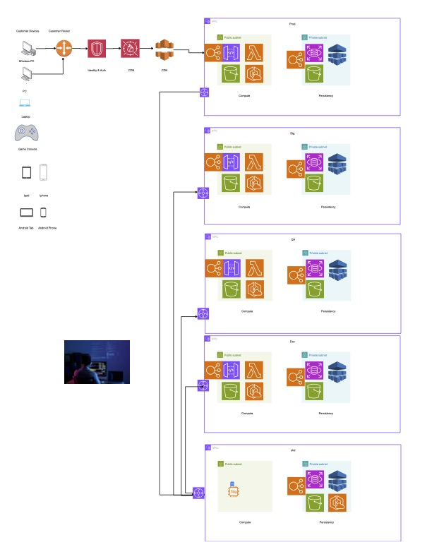

# NetSpinUP-documentation

NetSpinUp provides a platform for Mikrotik Users to manage devices using automation capabilities.

Folders will take you to links for wireframes and ideation (Figma)

Terraform provides IAC used in the project

APP provides source to application.

API provides APIGW Code

Scripts provides registration scripts used to enroll devices into the Platform.